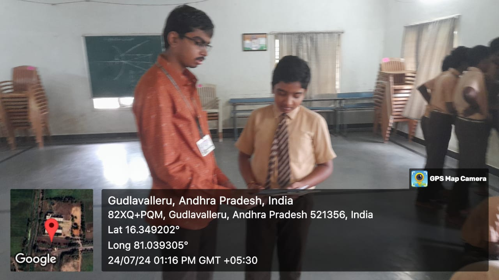
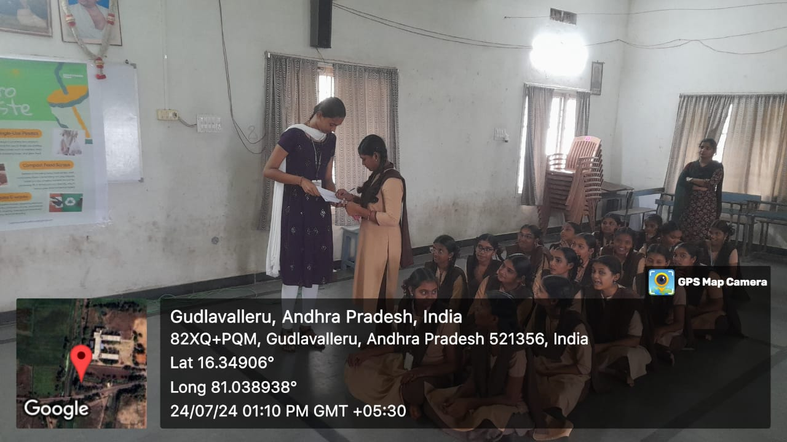
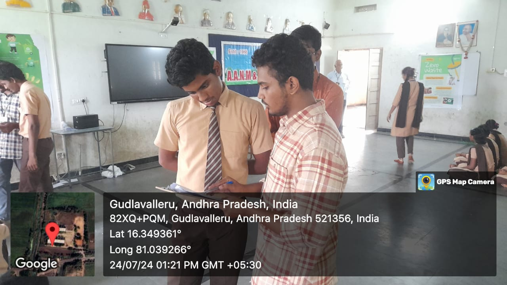
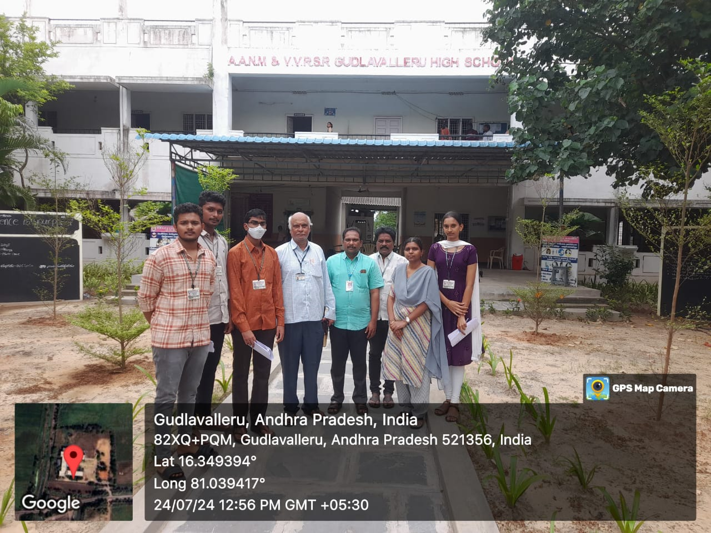

# Healthy Minds, Healthy Lives – WellnessBreak App  

> **Prioritizing Student Well-Being for a Brighter Future**  

## Abstract  
Increasing academic demands and lifestyle pressures have negatively affected students’ physical fitness and mental health. To address this, we developed **WellnessBreak**, a Flutter-based mobile application designed to promote student well-being through **customized notifications, physical activity tracking, hydration reminders, and step tracking**.  

The app encourages students to take **regular breaks**, **stay active**, and **maintain healthy routines** alongside their academic responsibilities. By integrating **technology-driven wellness practices**, the project aims to foster healthier lifestyles, reduce stress, and improve overall academic performance.  

Key features include:  
- **Customizable notifications** for study breaks, stretching, and hydration.  
- **Step tracking** with motivational feedback.  
- **Water intake calculator** based on personal details.  
- **Theme customization** for user preference.  
- **Help section** for easy navigation and support.  

---

## Features  
- **Study Mode Notifications**: Reminders for breaks & stretches while studying.  
- **Screen Time Management**: Notifications for prolonged mobile use.  
- **Step Tracking**: Daily step count with goal setting.  
- **Water Intake Calculator**: Personalized hydration goals.  
- **Dark/Light Theme**: Choose between app themes.  
- **Help Section**: FAQ and guidance for app usage.  

---

## Application Images  

### Home & Study Pages  
  
  
  
  

### Notifications  
  
  
  
  

### Setup & Tracking  
  
  
  
  
  
  

### Themes & Other Pages  
  
  
  

---

## Project Repository  
[**GitHub Repository**](https://github.com/Tatineni-Bhavya/CSP_code)
