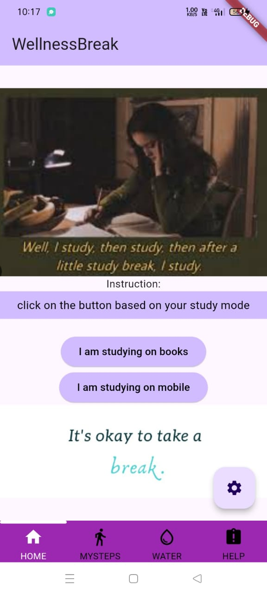
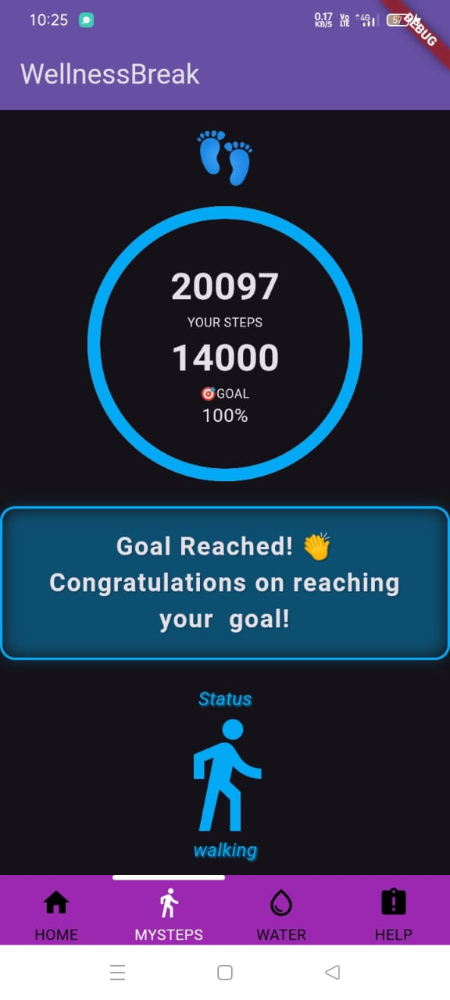
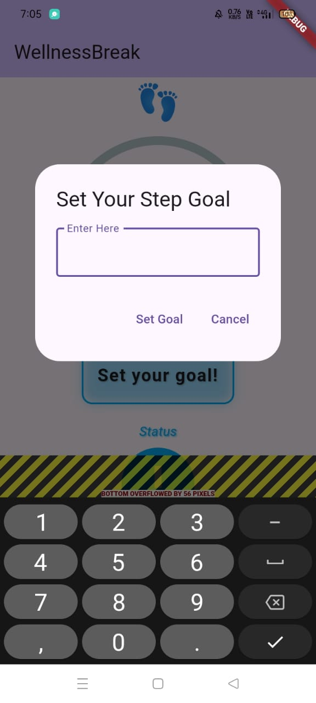

# WellnessBreak – Healthy Minds, Healthy Lives

> Prioritizing Student Well-Being for a Brighter Future

## Abstract
The academic journey often demands long hours of study, resulting in increased screen time, poor posture, irregular breaks, and unhealthy routines. WellnessBreak is a Flutter-based mobile app designed to help students manage their physical and mental well-being alongside academic success. It delivers categorized notifications, step tracking, and hydration goals to encourage regular breaks, movement, and self-care — helping students maintain balance between productivity and health.

## Problem Statement
Students today face a blend of academic stress, prolonged screen time, and sedentary lifestyles, leading to:

- Decline in physical fitness due to lack of movement.
- Increased stress & anxiety from academic pressure.
- Poor posture & digital eye strain caused by excessive device use.
- Neglect of hydration and nutrition due to improper routines.

## Solution
WellnessBreak provides technology-driven wellness support by:

- Sending categorized notifications for breaks, stretches, and hydration during study sessions.
- Tracking steps & physical activity with motivational feedback.
- Calculating personalized hydration goals based on user details.
- Offering a user-friendly interface to integrate wellness into daily routines.

This app empowers students to achieve academic goals without sacrificing health.

## Features
📲 Smart Notifications – Study mode reminders for breaks, hydration, and posture correction.

🚶 Step Tracking – Monitors daily physical activity using mobile sensors.

💧 Hydration Calculator – Calculates and tracks daily water intake goals.

🎨 Theme Customization – Switch between light and dark modes.

📘 Help Section – Simple guidance to navigate all features.

## Tech Stack
**Framework:** Flutter (Dart)

**UI:** Material Design & Cupertino Widgets

**Navigation:** Persistent Bottom Navigation Bar

**Storage:** Local storage for user preferences & tracking

## How to Run
Clone the repository:

```bash
git clone https://github.com/Tatineni-Bhavya/CSP_code.git
```

Navigate to the project directory:

```bash
cd CSP_code
```

Install dependencies:

```bash
flutter pub get
```

Run the app:

```bash
flutter run
```

## Future Scope
- **Integration with Wearable Devices:** Sync data from smartwatches for real-time activity monitoring.
- **Gamification:** Introduce wellness challenges & reward points for healthy habits.
- **Community Features:** Enable group participation in fitness activities for peer motivation.
- **Analytics Dashboard:** Provide weekly wellness insights for improved habit tracking.

## **Application Images**  
*(When you run this application, you will see the following outputs)*  

The **WellnessBreak** app has been successfully tested on:  
- **Android Emulator** (for development & debugging)  
- **Real Device:** **Oppo A16K Mobile**  

  


<div style="display: flex; flex-wrap: wrap; gap: 10px;">
  
  
  
  
  
  
  
  
  
  
  
  
  
  
  
  
  
  
  
</div>

